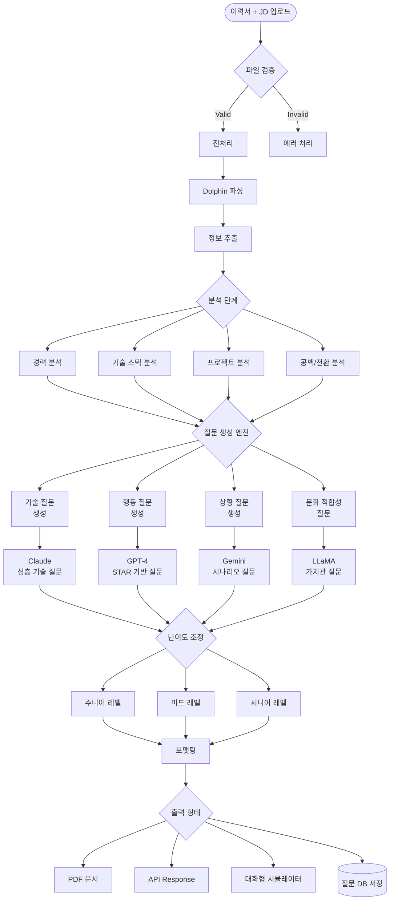
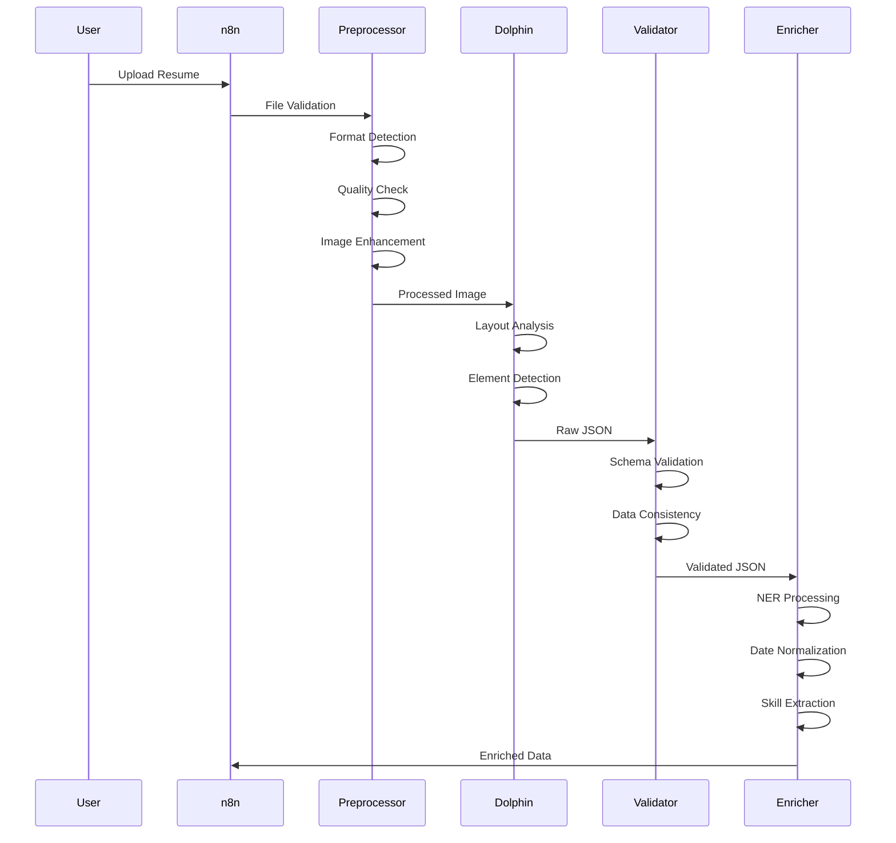
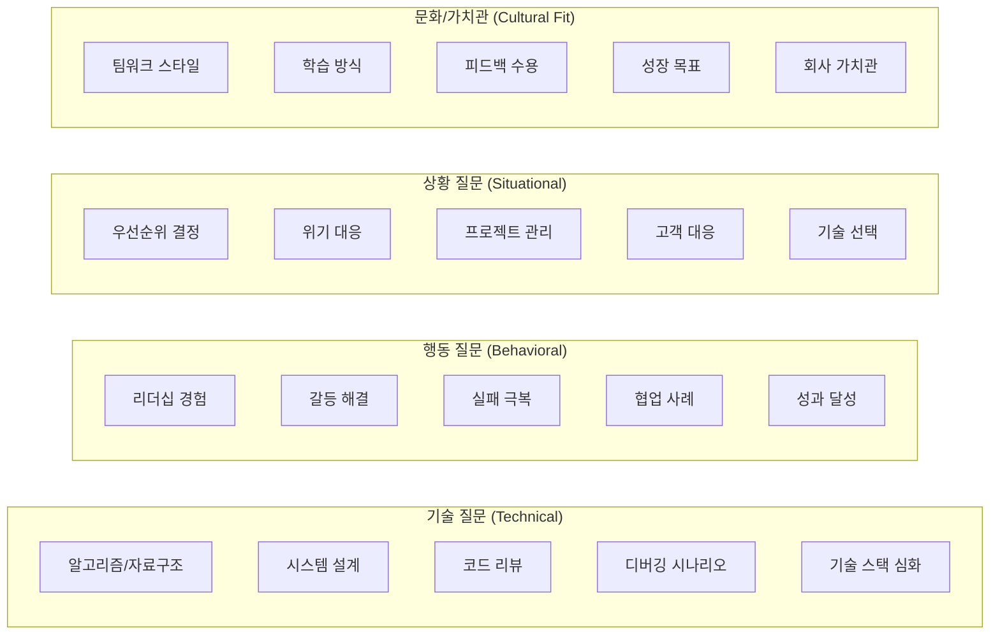
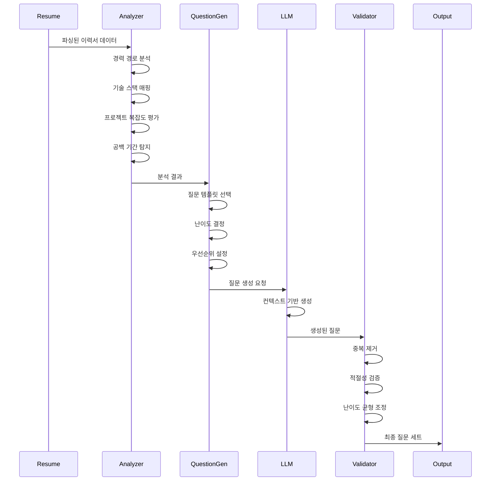
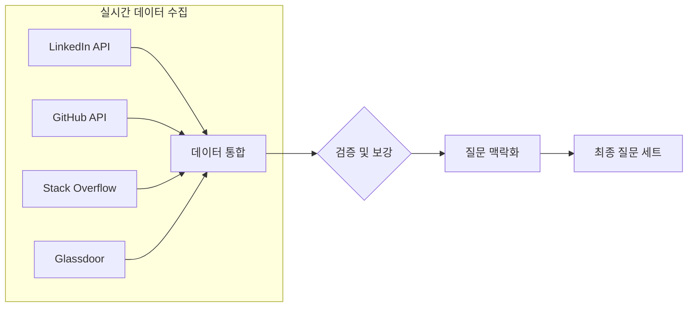

# 이력서 기반 면접 질문 생성 워크플로우

## 개요
n8n 기반 자동화 워크플로우로 구현하는 지능형 면접 질문 생성 시스템. Dolphin으로 이력서를 파싱하고, 다중 LLM을 활용해 맞춤형 기술/행동/상황 면접 질문을 자동 생성. 직무별, 경력별, 기술 스택별 최적화된 질문과 예상 답변 가이드 제공.

## 1. 아키텍처 설계

### 1.1 면접 질문 생성 워크플로우



### 1.2 n8n 워크플로우 노드 구성

#### 트리거 노드
- **Webhook**: 이력서 파일 수신
- **Google Drive Trigger**: 특정 폴더 모니터링
- **Email Trigger**: 이메일 첨부파일 처리
- **Schedule Trigger**: 배치 처리

#### 처리 노드
- **HTTP Request**: Dolphin API 호출
- **Function**: 커스텀 파싱 로직
- **Split in Batches**: 대량 처리
- **Merge**: 병렬 결과 통합

#### 통합 노드
- **OpenAI**: GPT-4 분석
- **Anthropic**: Claude 평가
- **Google Vertex AI**: Gemini 검토
- **PostgreSQL**: 데이터 저장
- **Redis**: 캐싱 처리

## 2. 고도화된 파싱 파이프라인

### 2.1 다단계 전처리 플로우



### 2.2 향상된 데이터 구조

```json
{
  "metadata": {
    "parse_timestamp": "2024-01-01T00:00:00Z",
    "confidence_score": 0.95,
    "language": "ko",
    "file_format": "pdf",
    "page_count": 2
  },
  "personal_info": {
    "name": {
      "value": "",
      "confidence": 0.98,
      "bounding_box": []
    },
    "contact": {
      "phone": "",
      "email": "",
      "linkedin": "",
      "github": "",
      "portfolio": ""
    },
    "location": {
      "city": "",
      "country": ""
    }
  },
  "professional_summary": {
    "text": "",
    "keywords": [],
    "sentiment": 0.0
  },
  "experience": [
    {
      "company": {
        "name": "",
        "industry": "",
        "size": ""
      },
      "position": {
        "title": "",
        "level": "",
        "department": ""
      },
      "period": {
        "start": "YYYY-MM-DD",
        "end": "YYYY-MM-DD",
        "duration_months": 0,
        "is_current": false
      },
      "responsibilities": [],
      "achievements": [],
      "technologies": [],
      "metrics": {
        "quantified_achievements": [],
        "impact_score": 0.0
      }
    }
  ],
  "education": [
    {
      "institution": "",
      "degree": "",
      "field": "",
      "gpa": "",
      "graduation_date": "",
      "relevance_score": 0.0
    }
  ],
  "skills": {
    "technical": {
      "languages": [],
      "frameworks": [],
      "databases": [],
      "tools": [],
      "cloud": []
    },
    "soft_skills": [],
    "certifications": [
      {
        "name": "",
        "issuer": "",
        "date": "",
        "verification_url": ""
      }
    ],
    "languages": [
      {
        "language": "",
        "proficiency": ""
      }
    ]
  },
  "projects": [
    {
      "name": "",
      "description": "",
      "technologies": [],
      "url": "",
      "github_stars": 0,
      "contributions": ""
    }
  ],
  "validation": {
    "missing_sections": [],
    "data_quality_issues": [],
    "formatting_issues": []
  }
}

## 3. 면접 질문 카테고리 및 생성 전략

### 3.1 질문 유형별 생성 매트릭스



### 3.2 경력 수준별 질문 난이도 조정

| 레벨 | 기술 깊이 | 프로젝트 규모 | 리더십 | 비즈니스 이해 | 예시 질문 |
|------|----------|-------------|---------|-------------|----------|
| **Junior (0-3년)** | 기초 개념 | 개인/소규모 | 자기 관리 | 기본 이해 | "Array vs LinkedList 차이점은?" |
| **Mid (3-7년)** | 심화 응용 | 팀 프로젝트 | 멘토링 | 도메인 지식 | "마이크로서비스 설계시 고려사항은?" |
| **Senior (7년+)** | 아키텍처 | 대규모 시스템 | 팀 리딩 | 전략적 사고 | "레거시 시스템 현대화 전략은?" |
| **Staff/Principal** | 혁신/R&D | 조직 전체 | 조직 설계 | 비즈니스 임팩트 | "기술 부채 관리 로드맵은?" |

### 3.3 LLM별 질문 생성 프롬프트

```yaml
technical_questions:
  claude_prompt:
    role: "Senior Technical Interviewer"
    context:
      - resume_data
      - job_description
      - tech_stack
    instructions:
      - Generate deep technical questions
      - Focus on problem-solving approach
      - Include follow-up questions
    output_format:
      - question: "main question"
        follow_ups: ["clarification", "edge case", "optimization"]
        evaluation_criteria: ["concept understanding", "practical application"]
        sample_answer_points: ["key concepts to cover"]

behavioral_questions:
  gpt4_prompt:
    role: "HR Behavioral Interview Specialist"
    framework: "STAR Method"
    focus_areas:
      - Leadership situations
      - Conflict resolution
      - Achievement stories
      - Failure and learning
    output_format:
      - question: "Tell me about a time when..."
        probing_questions: ["What was the outcome?", "What did you learn?"]
        red_flags: ["blame others", "no specific example"]
        green_flags: ["ownership", "growth mindset", "quantified impact"]

situational_questions:
  gemini_prompt:
    role: "Engineering Manager"
    scenarios:
      - Technical debt vs feature delivery
      - Team conflict resolution
      - Resource constraints
      - Stakeholder management
    output_format:
      - scenario: "detailed situation"
        question: "How would you handle..."
        evaluation_dimensions: ["analytical", "communication", "decision-making"]

culture_fit_questions:
  llama_prompt:
    role: "Culture Assessment Specialist"
    company_values: ["innovation", "collaboration", "customer-focus"]
    assessment_areas:
      - Work style preferences
      - Team dynamics
      - Growth mindset
      - Company mission alignment
```

## 4. 지능형 질문 생성 엔진

### 4.1 이력서 기반 맞춤 질문 생성



### 4.2 질문 깊이 조절 알고리즘

```json
{
  "question_depth_matrix": {
    "surface_level": {
      "purpose": "기본 지식 확인",
      "examples": [
        "REST API란 무엇인가요?",
        "Git의 주요 명령어를 설명해주세요"
      ],
      "time_allocation": "2-3분"
    },
    "application_level": {
      "purpose": "실무 적용 능력",
      "examples": [
        "대용량 트래픽 처리 경험을 설명해주세요",
        "CI/CD 파이프라인을 구축한 경험은?"
      ],
      "time_allocation": "5-7분"
    },
    "problem_solving": {
      "purpose": "문제 해결 능력",
      "examples": [
        "프로덕션 장애 대응 경험을 공유해주세요",
        "기술 부채를 해결한 사례는?"
      ],
      "time_allocation": "10-15분"
    },
    "architecture_design": {
      "purpose": "설계 및 추상화 능력",
      "examples": [
        "결제 시스템을 설계한다면?",
        "MSA 전환 전략을 수립한다면?"
      ],
      "time_allocation": "20-30분"
    }
  }
}
```

### 4.3 프로젝트 기반 심화 질문

```yaml
project_analysis:
  extraction_points:
    - technology_used
    - team_size
    - project_duration
    - business_impact
    - technical_challenges

  question_generation:
    technical_deep_dive:
      - "이 프로젝트에서 {technology}를 선택한 이유는?"
      - "{challenge}를 어떻게 해결했나요?"
      - "성능 최적화는 어떻게 진행했나요?"

    collaboration:
      - "{team_size}명 팀에서 어떻게 협업했나요?"
      - "의견 충돌은 어떻게 조율했나요?"
      - "코드 리뷰 프로세스는?"

    business_impact:
      - "비즈니스 지표 개선 효과는?"
      - "사용자 피드백은 어땠나요?"
      - "런칭 후 모니터링 전략은?"

  follow_up_patterns:
    - "더 자세히 설명해주실 수 있나요?"
    - "다시 한다면 무엇을 개선하시겠어요?"
    - "가장 큰 교훈은 무엇이었나요?"
```

## 5. n8n 워크플로우 구현

### 5.1 워크플로우 JSON 템플릿

```json
{
  "name": "Interview Question Generator",
  "nodes": [
    {
      "id": "webhook",
      "type": "n8n-nodes-base.webhook",
      "parameters": {
        "path": "interview-questions",
        "responseMode": "lastNode",
        "httpMethod": "POST"
      }
    },
    {
      "id": "dolphin_api",
      "type": "n8n-nodes-base.httpRequest",
      "parameters": {
        "url": "http://localhost:8000/parse",
        "method": "POST",
        "bodyParameters": {
          "file": "={{$json.resume}}",
          "mode": "page_level"
        }
      }
    },
    {
      "id": "parallel_llm",
      "type": "n8n-nodes-base.split",
      "parameters": {
        "batchSize": 1,
        "options": {
          "batches": [
            {"llm": "claude", "type": "technical"},
            {"llm": "gpt4", "type": "behavioral"},
            {"llm": "gemini", "type": "situational"}
          ]
        }
      }
    },
    {
      "id": "merge_results",
      "type": "n8n-nodes-base.merge",
      "parameters": {
        "mode": "multiplex"
      }
    },
    {
      "id": "format_output",
      "type": "n8n-nodes-base.function",
      "parameters": {
        "functionCode": "return formatInterviewQuestions($input.all())"
      }
    }
  ]
}
```

### 5.2 외부 데이터 소스 통합



### 5.3 캐싱 및 성능 최적화

```yaml
caching_strategy:
  redis:
    resume_parse_cache:
      ttl: 3600  # 1시간
      key_pattern: "resume:{hash}"

    question_cache:
      ttl: 86400  # 24시간
      key_pattern: "questions:{job_id}:{level}"

    llm_response_cache:
      ttl: 7200  # 2시간
      key_pattern: "llm:{model}:{prompt_hash}"

  performance_optimization:
    - Parallel LLM calls
    - Batch processing for multiple resumes
    - Async I/O operations
    - Connection pooling for APIs
```

## 6. 면접 질문 출력 형식

### 6.1 구조화된 질문 세트 (JSON)

```json
{
  "interview_set": {
    "candidate_name": "김개발",
    "position": "Senior Backend Engineer",
    "total_questions": 25,
    "estimated_duration": "90분",
    "difficulty_distribution": {
      "easy": 5,
      "medium": 12,
      "hard": 8
    },
    "categories": {
      "technical": {
        "count": 10,
        "questions": [
          {
            "id": "T001",
            "question": "마이크로서비스 간 트랜잭션 관리 방법은?",
            "difficulty": "hard",
            "expected_time": "10분",
            "evaluation_criteria": [
              "Saga 패턴 이해",
              "2PC vs Eventual Consistency",
              "실제 구현 경험"
            ],
            "follow_ups": [
              "보상 트랜잭션 구현 방법은?",
              "실패 시나리오 처리는?"
            ],
            "good_answer_includes": [
              "Choreography vs Orchestration",
              "Outbox 패턴",
              "Idempotency"
            ]
          }
        ]
      },
      "behavioral": {
        "count": 8,
        "questions": [
          {
            "id": "B001",
            "question": "기술적 의견 충돌을 해결한 경험은?",
            "difficulty": "medium",
            "expected_time": "7분",
            "star_components": {
              "situation": "팀 내 기술 선택 갈등",
              "task": "합의 도출",
              "action": "데이터 기반 의사결정",
              "result": "성공적 구현"
            }
          }
        ]
      }
    }
  }
}
```

### 6.2 면접관용 가이드

```markdown
# 면접 진행 가이드

## 시간 배분
- Ice Breaking: 5분
- 기술 질문: 40분
- 행동 질문: 30분
- 상황 질문: 10분
- 질의응답: 5분

## 평가 체크리스트
□ 기술 깊이
□ 문제 해결 접근법
□ 커뮤니케이션 스킬
□ 팀워크 능력
□ 학습 의지

## Red Flags
- 구체적 사례 없음
- 책임 회피
- 과도한 과장
- 기술 트렌드만 언급

## Green Flags
- 구체적 숫자/지표
- 실패 경험 공유
- 개선 의지
- 팀 기여도 언급
```

### 6.3 지원자용 준비 가이드

```yaml
preparation_guide:
  technical_preparation:
    - Review your projects in detail
    - Prepare system design examples
    - Practice coding problems
    - Research company tech stack

  behavioral_preparation:
    - Prepare 5-7 STAR stories
    - Quantify your achievements
    - Think about failures and learnings
    - Research company culture

  questions_to_ask:
    - Team structure and collaboration
    - Technical challenges
    - Growth opportunities
    - Work-life balance
```

## 7. 구현 로드맵

### Phase 1: MVP (2주)
- [ ] Dolphin API 서버 구축
- [ ] 기본 파싱 로직 구현
- [ ] 단일 LLM 통합 (Claude)
- [ ] CLI 인터페이스

### Phase 2: 고도화 (3주)
- [ ] 다중 LLM 통합
- [ ] n8n 워크플로우 구성
- [ ] 질문 DB 구축
- [ ] 난이도 조절 알고리즘

### Phase 3: 확장 (4주)
- [ ] 외부 API 연동
- [ ] 웹 인터페이스
- [ ] 면접 시뮬레이터
- [ ] 분석 대시보드

### Phase 4: 운영 (지속)
- [ ] A/B 테스트
- [ ] 질문 품질 개선
- [ ] 사용자 피드백 반영
- [ ] 성능 최적화

## 8. 확장 가능성

### 8.1 AI 면접관 시뮬레이터
- 실시간 음성 인식
- 답변 분석 및 피드백
- 모의 면접 녹화
- 개선점 레포트

### 8.2 기업 맞춤형 서비스
- 회사별 면접 스타일 학습
- 과거 합격자 패턴 분석
- 직무 기술서 자동 매칭
- 맞춤형 준비 커리큘럼

### 8.3 데이터 기반 인사이트
- 업계별 면접 트렌드
- 인기 질문 통계
- 합격률 예측 모델
- 경력 개발 로드맵

## 참고 자료
- Dolphin 논문: https://arxiv.org/abs/2406.18842
- HuggingFace 모델: https://huggingface.co/ByteDance/Dolphin
- n8n 문서: https://docs.n8n.io
- STAR Method: https://www.thebalancecareers.com/star-interview-method