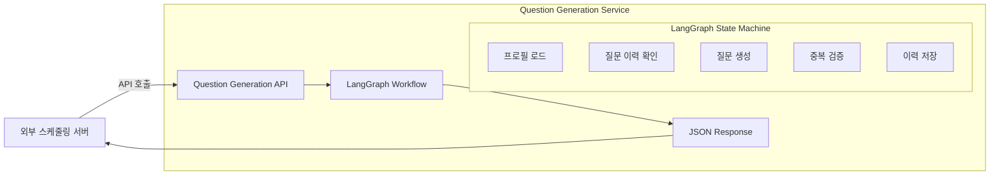
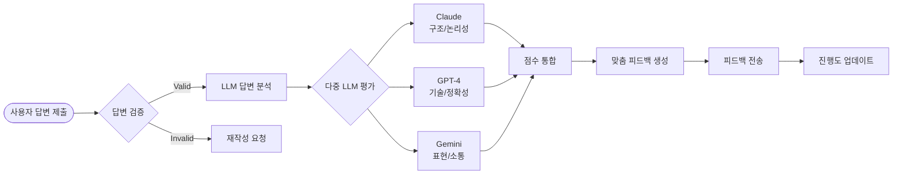
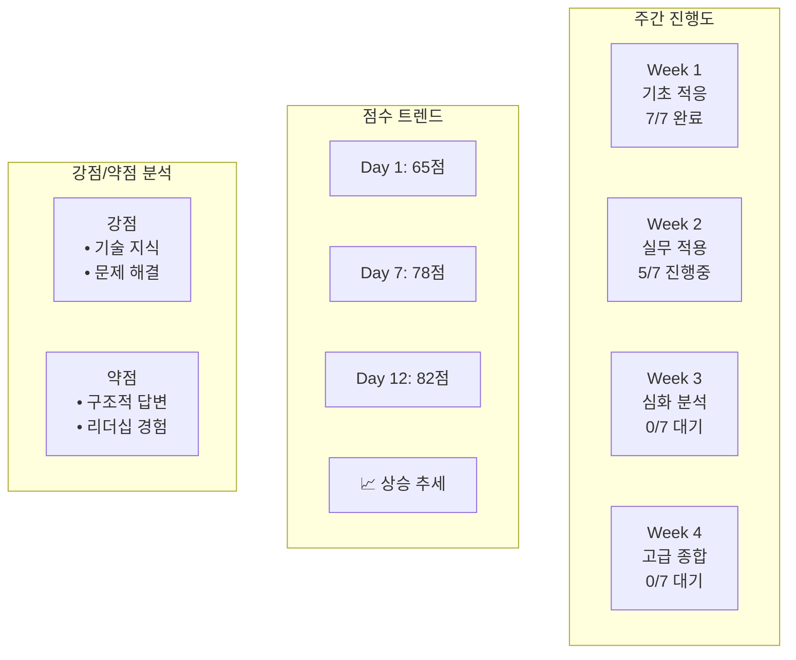
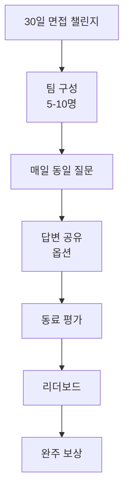

# 면접 질문 생성 API 서비스

## 개요
이력서를 기반으로 개인화된 면접 질문을 생성하는 LangGraph API 서비스. Dolphin으로 이력서를 파싱하고, 이전 질문 이력을 고려하여 중복되지 않는 맞춤형 질문을 생성. 스케줄링 발송은 외부 서버에서 담당하며, 이 서비스는 순수 질문 생성 로직만 제공.

## 1. 서비스 모델 설계

### 1.1 API 서비스 아키텍처



### 1.2 다중 이력서 지원 API 설계

```python
from fastapi import FastAPI, HTTPException, UploadFile, File
from pydantic import BaseModel
from typing import List, Optional
import uuid

app = FastAPI(title="Interview Question Generator")

class QuestionRequest(BaseModel):
    user_id: str
    resume_id: Optional[str] = None  # 특정 이력서 지정
    session_id: Optional[str] = None  # 질문 세션 ID
    target_position: str
    difficulty_preference: float = 0.5
    excluded_categories: List[str] = []

class QuestionResponse(BaseModel):
    question_id: str
    question: str
    category: str
    difficulty: float
    estimated_time: int
    context: dict
    learning_objectives: List[str]
    resume_id: str  # 어떤 이력서 기반인지
    session_id: Optional[str]

class ResumeInfo(BaseModel):
    resume_id: str
    file_name: str
    is_primary: bool
    parsing_confidence: float
    created_at: str

# 1. 이력서 관리 API
@app.post("/user/{user_id}/resumes")
async def upload_resume(
    user_id: str,
    file: UploadFile = File(...),
    is_primary: bool = False
):
    """이력서 업로드 및 파싱"""

    # 파일 저장
    file_path = await save_uploaded_file(file)

    # Dolphin 파싱
    parsed_data = await parse_resume_with_dolphin(file_path)

    # DB 저장
    resume_id = str(uuid.uuid4())
    await save_resume({
        "resume_id": resume_id,
        "user_id": user_id,
        "file_name": file.filename,
        "file_path": file_path,
        "parsed_data": parsed_data,
        "parsing_confidence": parsed_data["metadata"]["confidence_score"],
        "is_primary": is_primary
    })

    return {"resume_id": resume_id, "status": "uploaded"}

@app.get("/user/{user_id}/resumes", response_model=List[ResumeInfo])
async def get_user_resumes(user_id: str):
    """사용자의 모든 이력서 조회"""
    resumes = await load_user_resumes(user_id)
    return [ResumeInfo(**resume) for resume in resumes]

@app.delete("/user/{user_id}/resumes/{resume_id}")
async def delete_resume(user_id: str, resume_id: str):
    """이력서 삭제"""
    await remove_resume(user_id, resume_id)
    return {"status": "deleted"}

# 2. 질문 세션 관리 API
@app.post("/user/{user_id}/sessions")
async def create_question_session(
    user_id: str,
    resume_id: str,
    target_position: str,
    session_name: str
):
    """새 질문 세션 생성"""
    session_id = str(uuid.uuid4())

    await save_question_session({
        "session_id": session_id,
        "user_id": user_id,
        "resume_id": resume_id,
        "target_position": target_position,
        "session_name": session_name,
        "is_active": True
    })

    return {"session_id": session_id}

@app.get("/user/{user_id}/sessions")
async def get_user_sessions(user_id: str):
    """사용자의 질문 세션 목록"""
    sessions = await load_user_sessions(user_id)
    return sessions

# 3. 질문 생성 API (개선됨)
@app.post("/generate-question", response_model=QuestionResponse)
async def generate_question(request: QuestionRequest):
    """다중 이력서 지원 질문 생성"""

    # 이력서 결정 로직
    if request.resume_id:
        resume_id = request.resume_id
    elif request.session_id:
        session = await load_session(request.session_id)
        resume_id = session["resume_id"]
    else:
        # 기본 이력서 사용
        primary_resume = await get_primary_resume(request.user_id)
        resume_id = primary_resume["resume_id"]

    # 질문 이력 로드 (이력서별)
    question_history = await load_question_history(
        user_id=request.user_id,
        resume_id=resume_id
    )

    workflow = create_question_generation_workflow()

    initial_state = {
        "user_id": request.user_id,
        "resume_id": resume_id,
        "session_id": request.session_id,
        "target_position": request.target_position,
        "difficulty_preference": request.difficulty_preference,
        "excluded_categories": request.excluded_categories,
        "question_history": question_history
    }

    result = await workflow.ainvoke(initial_state)

    if result.get("error"):
        raise HTTPException(status_code=400, detail=result["error"])

    return QuestionResponse(**result["generated_question"])

# 4. 분석 API
@app.get("/user/{user_id}/analytics")
async def get_user_analytics(user_id: str, resume_id: Optional[str] = None):
    """사용자 분석 (전체 또는 이력서별)"""

    if resume_id:
        # 특정 이력서 기반 분석
        analytics = await calculate_resume_analytics(user_id, resume_id)
    else:
        # 전체 이력서 통합 분석
        analytics = await calculate_user_analytics(user_id)

    return analytics

@app.get("/user/{user_id}/resumes/{resume_id}/comparison")
async def compare_resumes(user_id: str, resume_id: str, compare_with: str):
    """이력서 간 비교 분석"""

    comparison = await compare_resume_profiles(
        user_id=user_id,
        resume_id_1=resume_id,
        resume_id_2=compare_with
    )

    return {
        "skill_differences": comparison["skill_gaps"],
        "experience_differences": comparison["experience_gaps"],
        "question_difficulty_comparison": comparison["difficulty_trends"],
        "recommendation": comparison["switch_recommendation"]
    }
```

### 1.2 핵심 컴포넌트

#### 질문 생성 엔진
- **이력서 분석**: 경력/기술/프로젝트 추출
- **개인화 알고리즘**: 약점/강점 기반 질문 우선순위
- **난이도 곡선**: 점진적 어려움 증가
- **다양성 보장**: 기술/행동/상황 질문 균형

#### 스케줄링 시스템
- **n8n 크론잡**: 매일 정해진 시간 실행
- **시간대 대응**: 사용자별 로컬 시간
- **휴일 스킵**: 주말/공휴일 옵션
- **재시도 로직**: 전송 실패시 재발송

#### 피드백 시스템
- **즉시 피드백**: 답변 제출 후 5분 내
- **상세 분석**: 강점/개선점/추천사항
- **점수 추적**: 진행도 시각화
- **개선 제안**: 다음 단계 가이드

## 2. LangGraph 워크플로우 설계

### 2.1 질문 생성 상태 머신

```python
from langgraph.graph import StateGraph, END
from typing import TypedDict, List, Optional

class QuestionGenerationState(TypedDict):
    user_id: str
    resume_id: str  # 추가: 어떤 이력서 기반인지
    session_id: Optional[str]  # 추가: 질문 세션 ID
    resume_data: Optional[dict]
    target_position: str
    difficulty_preference: float
    excluded_categories: List[str]
    question_history: List[dict]  # 이제 resume_id별로 필터링됨
    user_profile: Optional[dict]
    candidate_topics: List[dict]
    generated_question: Optional[dict]
    error: Optional[str]

def create_question_generation_workflow():
    """질문 생성 LangGraph 워크플로우 생성"""

    workflow = StateGraph(QuestionGenerationState)

    # 노드 추가
    workflow.add_node("load_user_profile", load_user_profile_node)
    workflow.add_node("analyze_question_history", analyze_history_node)
    workflow.add_node("generate_candidate_topics", generate_topics_node)
    workflow.add_node("select_best_topic", select_topic_node)
    workflow.add_node("generate_question", generate_question_node)
    workflow.add_node("validate_uniqueness", validate_uniqueness_node)
    workflow.add_node("save_question_history", save_history_node)
    workflow.add_node("handle_error", error_handler_node)

    # 워크플로우 연결
    workflow.set_entry_point("load_user_profile")

    workflow.add_edge("load_user_profile", "analyze_question_history")
    workflow.add_edge("analyze_question_history", "generate_candidate_topics")
    workflow.add_edge("generate_candidate_topics", "select_best_topic")
    workflow.add_edge("select_best_topic", "generate_question")
    workflow.add_edge("generate_question", "validate_uniqueness")

    # 조건부 엣지
    workflow.add_conditional_edges(
        "validate_uniqueness",
        route_validation_result,
        {
            "unique": "save_question_history",
            "duplicate": "generate_candidate_topics",  # 재생성
            "error": "handle_error"
        }
    )

    workflow.add_edge("save_question_history", END)
    workflow.add_edge("handle_error", END)

    return workflow.compile()

def route_validation_result(state: QuestionGenerationState) -> str:
    """검증 결과에 따른 라우팅"""
    if state.get("error"):
        return "error"

    question = state.get("generated_question", {})
    if question.get("is_duplicate", False):
        return "duplicate"
    else:
        return "unique"
```

### 2.2 중복 방지 로직

```python
async def validate_uniqueness_node(state: QuestionGenerationState) -> QuestionGenerationState:
    """질문 중복 검증 노드"""

    generated_question = state["generated_question"]
    question_history = state["question_history"]

    # 1. 텍스트 유사도 검사
    similarity_scores = []
    for past_question in question_history:
        similarity = calculate_text_similarity(
            generated_question["question"],
            past_question["question"]
        )
        similarity_scores.append(similarity)

    max_similarity = max(similarity_scores) if similarity_scores else 0.0

    # 2. 주제/키워드 중복 검사
    topic_overlap = check_topic_overlap(
        generated_question["learning_objectives"],
        [q["learning_objectives"] for q in question_history]
    )

    # 3. 중복 판정
    is_duplicate = (
        max_similarity > 0.8 or  # 80% 이상 유사
        topic_overlap > 0.7      # 70% 이상 주제 중복
    )

    if is_duplicate:
        # 재생성을 위한 제약 조건 추가
        excluded_topics = extract_excluded_topics(question_history)
        return {
            **state,
            "generated_question": {**generated_question, "is_duplicate": True},
            "excluded_topics": excluded_topics,
            "retry_count": state.get("retry_count", 0) + 1
        }

    return {
        **state,
        "generated_question": {**generated_question, "is_duplicate": False}
    }

def calculate_text_similarity(text1: str, text2: str) -> float:
    """텍스트 유사도 계산 (임베딩 기반)"""
    # 실제 구현시 sentence-transformers 사용
    from sentence_transformers import SentenceTransformer

    model = SentenceTransformer('all-MiniLM-L6-v2')
    embeddings = model.encode([text1, text2])

    # 코사인 유사도 계산
    from sklearn.metrics.pairwise import cosine_similarity
    similarity = cosine_similarity([embeddings[0]], [embeddings[1]])[0][0]

    return float(similarity)

def check_topic_overlap(new_topics: List[str], past_topics_list: List[List[str]]) -> float:
    """주제 중복도 검사"""
    if not past_topics_list:
        return 0.0

    all_past_topics = set()
    for topics in past_topics_list:
        all_past_topics.update(topics)

    new_topics_set = set(new_topics)
    overlap = len(new_topics_set.intersection(all_past_topics))

    return overlap / len(new_topics_set) if new_topics_set else 0.0
```

## 3. 완전한 LangGraph 질문 생성 다이어그램

### 3.1 LangGraph State Machine 시각화

```mermaid
graph TB
    Start([API 호출<br/>POST /generate-question]) --> LoadProfile[load_user_profile<br/>사용자 프로필 로드]

    LoadProfile --> CheckResume{이력서 데이터<br/>존재 여부}
    CheckResume -->|없음| ParseResume[parse_resume<br/>Dolphin API 호출]
    CheckResume -->|있음| AnalyzeHistory[analyze_question_history<br/>질문 이력 분석]

    ParseResume --> CreateProfile[create_user_profile<br/>프로필 생성]
    CreateProfile --> AnalyzeHistory

    AnalyzeHistory --> GenerateTopics[generate_candidate_topics<br/>후보 주제 생성]
    GenerateTopics --> SelectTopic[select_best_topic<br/>최적 주제 선택]

    SelectTopic --> GenerateQ[generate_question<br/>질문 생성 (LLM)]
    GenerateQ --> ValidateUnique{validate_uniqueness<br/>중복 검증}

    ValidateUnique -->|중복됨| CheckRetry{재시도 횟수<br/>< 3}
    CheckRetry -->|Yes| GenerateTopics
    CheckRetry -->|No| HandleError[handle_error<br/>에러 처리]

    ValidateUnique -->|고유함| SaveHistory[save_question_history<br/>질문 이력 저장]
    SaveHistory --> ReturnQuestion[질문 응답 반환]

    HandleError --> ReturnError[에러 응답]
    ReturnQuestion --> End([API 응답])
    ReturnError --> End

    %% 스타일링
    classDef startEnd fill:#e1f5fe
    classDef process fill:#f3e5f5
    classDef decision fill:#fff3e0
    classDef llm fill:#e8f5e8
    classDef storage fill:#fce4ec
    classDef error fill:#ffebee

    class Start,End,ReturnQuestion,ReturnError startEnd
    class LoadProfile,ParseResume,CreateProfile,GenerateTopics,SelectTopic,SaveHistory process
    class CheckResume,ValidateUnique,CheckRetry decision
    class GenerateQ llm
    class AnalyzeHistory storage
    class HandleError error
```

### 3.2 LangGraph 상태 차트 (State Chart)

```mermaid
stateDiagram-v2
    [*] --> LoadingProfile : API Request

    state LoadingProfile {
        [*] --> CheckCache : Load User Profile
        CheckCache --> CacheHit : Profile exists
        CheckCache --> CacheMiss : No profile

        CacheHit --> ProfileLoaded
        CacheMiss --> ParseResume

        state ParseResume {
            [*] --> DolphinCall : Call Dolphin API
            DolphinCall --> ParsingSuccess : Success
            DolphinCall --> ParsingFailed : Failed

            ParsingSuccess --> CreateProfile : Extract data
            ParsingFailed --> [*] : Error

            CreateProfile --> ProfileCreated
            ProfileCreated --> [*]
        }

        ParseResume --> ProfileLoaded : Profile created
        ProfileLoaded --> [*]
    }

    LoadingProfile --> AnalyzingHistory : Profile ready
    LoadingProfile --> ErrorHandling : Load failed

    state AnalyzingHistory {
        [*] --> CheckHistory : Get question history
        CheckHistory --> EmptyHistory : No questions
        CheckHistory --> HasHistory : Questions exist

        EmptyHistory --> FirstTimeAnalysis
        HasHistory --> DetailedAnalysis

        state DetailedAnalysis {
            [*] --> CategoryDistribution
            CategoryDistribution --> TopicCoverage
            TopicCoverage --> GapIdentification
            GapIdentification --> TrendAnalysis
            TrendAnalysis --> [*]
        }

        FirstTimeAnalysis --> AnalysisComplete
        DetailedAnalysis --> AnalysisComplete
        AnalysisComplete --> [*]
    }

    AnalyzingHistory --> GeneratingTopics : Analysis complete

    state GeneratingTopics {
        [*] --> WeaknessTopics : Generate weakness-based topics
        WeaknessTopics --> ExperienceTopics : Add experience topics
        ExperienceTopics --> BalanceTopics : Add balance topics
        BalanceTopics --> PrioritizeTopics : Sort by priority
        PrioritizeTopics --> TopicsGenerated
        TopicsGenerated --> [*]
    }

    GeneratingTopics --> SelectingTopic : Topics ready

    state SelectingTopic {
        [*] --> CheckExclusions : Apply exclusions
        CheckExclusions --> SelectBest : Pick highest priority
        SelectBest --> TopicSelected
        TopicSelected --> [*]
    }

    SelectingTopic --> GeneratingQuestion : Topic selected

    state GeneratingQuestion {
        [*] --> BuildPrompt : Create LLM prompt
        BuildPrompt --> CallLLM : Send to Claude/GPT
        CallLLM --> LLMSuccess : Response received
        CallLLM --> LLMFailed : API error

        LLMSuccess --> ParseResponse : Extract JSON
        ParseResponse --> QuestionGenerated
        LLMFailed --> RetryLLM : Retry < 3
        LLMFailed --> UseFallback : Max retries

        RetryLLM --> CallLLM
        UseFallback --> QuestionGenerated
        QuestionGenerated --> [*]
    }

    GeneratingQuestion --> ValidatingUniqueness : Question ready

    state ValidatingUniqueness {
        [*] --> TextSimilarity : Check text similarity
        TextSimilarity --> TopicOverlap : Check topic overlap
        TopicOverlap --> DuplicateCheck : Combine scores

        DuplicateCheck --> IsUnique : < 80% similar
        DuplicateCheck --> IsDuplicate : >= 80% similar

        IsUnique --> ValidationPassed
        IsDuplicate --> ValidationFailed

        ValidationPassed --> [*]
        ValidationFailed --> [*]
    }

    ValidatingUniqueness --> SavingHistory : Validation passed
    ValidatingUniqueness --> CheckingRetry : Validation failed

    state CheckingRetry {
        [*] --> CountRetries : Check retry count
        CountRetries --> CanRetry : < 3 attempts
        CountRetries --> MaxRetries : >= 3 attempts

        CanRetry --> [*]
        MaxRetries --> [*]
    }

    CheckingRetry --> GeneratingTopics : Can retry
    CheckingRetry --> ErrorHandling : Max retries

    state SavingHistory {
        [*] --> SaveToDB : Store question history
        SaveToDB --> UpdateProfile : Update user profile
        UpdateProfile --> HistorySaved
        HistorySaved --> [*]
    }

    SavingHistory --> Success : History saved

    state ErrorHandling {
        [*] --> LogError : Log error details
        LogError --> GenerateFallback : Create fallback
        GenerateFallback --> ErrorHandled
        ErrorHandled --> [*]
    }

    ErrorHandling --> Error : Error response

    Success --> [*] : Return question
    Error --> [*] : Return error

    note right of LoadingProfile : State: user_profile, resume_data
    note right of AnalyzingHistory : State: coverage_analysis, question_history
    note right of GeneratingTopics : State: candidate_topics[]
    note right of SelectingTopic : State: selected_topic
    note right of GeneratingQuestion : State: generated_question
    note right of ValidatingUniqueness : State: is_duplicate, similarity_score
    note right of SavingHistory : State: question_id, saved_at
```

### 3.3 상태 데이터 플로우

```mermaid
graph LR
    subgraph "Initial State"
        IS[user_id<br/>resume_data<br/>target_position<br/>difficulty_preference<br/>excluded_categories]
    end

    subgraph "After LoadProfile"
        LP[+ user_profile<br/>+ parsing_confidence]
    end

    subgraph "After AnalyzeHistory"
        AH[+ question_history<br/>+ coverage_analysis<br/>+ gap_areas]
    end

    subgraph "After GenerateTopics"
        GT[+ candidate_topics<br/>+ priority_scores]
    end

    subgraph "After SelectTopic"
        ST[+ selected_topic<br/>+ reasoning]
    end

    subgraph "After GenerateQuestion"
        GQ[+ generated_question<br/>+ question_id<br/>+ metadata]
    end

    subgraph "After ValidateUniqueness"
        VU[+ is_duplicate<br/>+ similarity_score<br/>+ retry_count]
    end

    subgraph "Final State"
        FS[+ question_saved<br/>+ response_ready]
    end

    IS --> LP
    LP --> AH
    AH --> GT
    GT --> ST
    ST --> GQ
    GQ --> VU
    VU --> FS

    %% 조건부 루프
    VU -.->|duplicate & retry < 3| GT
    VU -.->|duplicate & retry >= 3| Error[Error State]
```



### 3.4 상태 전환 조건 매트릭스

```python
# 상태 전환 조건 정의
STATE_TRANSITIONS = {
    "load_user_profile": {
        "success_conditions": ["user_profile is not None"],
        "failure_conditions": ["user_id invalid", "database_error"],
        "next_states": {
            "success": "analyze_question_history",
            "failure": "handle_error"
        }
    },

    "analyze_question_history": {
        "success_conditions": ["coverage_analysis generated"],
        "next_states": {
            "success": "generate_candidate_topics"
        }
    },

    "generate_candidate_topics": {
        "success_conditions": ["len(candidate_topics) > 0"],
        "failure_conditions": ["no topics generated"],
        "next_states": {
            "success": "select_best_topic",
            "failure": "handle_error"
        }
    },

    "select_best_topic": {
        "success_conditions": ["selected_topic is not None"],
        "next_states": {
            "success": "generate_question"
        }
    },

    "generate_question": {
        "success_conditions": [
            "generated_question is not None",
            "question field exists",
            "category field valid"
        ],
        "failure_conditions": [
            "llm_api_error",
            "invalid_json_response",
            "rate_limit_exceeded"
        ],
        "next_states": {
            "success": "validate_uniqueness",
            "failure": "handle_error"
        }
    },

    "validate_uniqueness": {
        "branch_conditions": {
            "unique": [
                "similarity_score < 0.8",
                "topic_overlap < 0.7"
            ],
            "duplicate": [
                "similarity_score >= 0.8 OR topic_overlap >= 0.7",
                "retry_count < 3"
            ],
            "error": [
                "similarity_score >= 0.8 OR topic_overlap >= 0.7",
                "retry_count >= 3"
            ]
        },
        "next_states": {
            "unique": "save_question_history",
            "duplicate": "generate_candidate_topics",  # 재시도
            "error": "handle_error"
        }
    },

    "save_question_history": {
        "success_conditions": ["question saved to database"],
        "failure_conditions": ["database_error"],
        "next_states": {
            "success": "END",
            "failure": "handle_error"
        }
    }
}

# 상태 검증 함수
def validate_state_transition(current_state: str, state_data: dict) -> str:
    """상태 전환 조건 검증"""

    transition_rules = STATE_TRANSITIONS.get(current_state, {})

    if current_state == "validate_uniqueness":
        # 분기 조건 검사
        similarity = state_data.get("similarity_score", 0)
        topic_overlap = state_data.get("topic_overlap", 0)
        retry_count = state_data.get("retry_count", 0)

        if similarity < 0.8 and topic_overlap < 0.7:
            return "unique"
        elif retry_count >= 3:
            return "error"
        else:
            return "duplicate"

    # 일반 성공/실패 조건 검사
    success_conditions = transition_rules.get("success_conditions", [])
    failure_conditions = transition_rules.get("failure_conditions", [])

    # 실패 조건 우선 검사
    for condition in failure_conditions:
        if check_condition(condition, state_data):
            return "failure"

    # 성공 조건 검사
    for condition in success_conditions:
        if not check_condition(condition, state_data):
            return "failure"

    return "success"

def check_condition(condition: str, state_data: dict) -> bool:
    """조건 검사 로직"""
    # 실제 구현에서는 더 정교한 조건 파싱 필요
    if "is not None" in condition:
        field = condition.split()[0]
        return state_data.get(field) is not None
    elif "len(" in condition and "> 0" in condition:
        field = condition.split("(")[1].split(")")[0]
        return len(state_data.get(field, [])) > 0
    # 추가 조건들...

    return True
```

### 3.5 핵심 노드 구현

```python
async def generate_question_node(state: QuestionGenerationState) -> QuestionGenerationState:
    """LLM을 사용한 질문 생성 노드"""

    user_profile = state["user_profile"]
    selected_topic = state["selected_topic"]
    difficulty = state["difficulty_preference"]
    excluded_topics = state.get("excluded_topics", [])

    # 프롬프트 구성
    prompt = f"""
    당신은 면접관입니다. 다음 정보를 바탕으로 개인화된 면접 질문을 생성하세요.

    지원자 정보:
    - 목표 직무: {state['target_position']}
    - 경력 수준: {user_profile['experience_level']}
    - 주요 기술: {user_profile['technical_skills']}
    - 약점 영역: {user_profile['weak_areas']}

    질문 요구사항:
    - 주제: {selected_topic['topic']}
    - 카테고리: {selected_topic['category']}
    - 난이도: {difficulty} (0.0-1.0)
    - 예상 답변 시간: 5-15분

    제외할 주제들: {excluded_topics}

    다음 형식으로 응답하세요:
    {{
        "question": "질문 내용",
        "category": "technical|behavioral|situational|cultural",
        "difficulty": 0.7,
        "estimated_time": 10,
        "learning_objectives": ["목표1", "목표2"],
        "context": {{
            "background": "질문 배경",
            "evaluation_criteria": ["평가 기준1", "평가 기준2"]
        }}
    }}
    """

    try:
        # Claude API 호출
        response = await claude_api.generate_question(
            prompt=prompt,
            temperature=0.7,
            max_tokens=500
        )

        generated_question = json.loads(response.content)

        # 메타데이터 추가
        generated_question.update({
            "question_id": str(uuid.uuid4()),
            "generated_at": datetime.now().isoformat(),
            "user_id": state["user_id"],
            "topic_source": selected_topic
        })

        return {
            **state,
            "generated_question": generated_question
        }

    except Exception as e:
        return {
            **state,
            "error": f"Question generation failed: {str(e)}"
        }

async def analyze_history_node(state: QuestionGenerationState) -> QuestionGenerationState:
    """질문 이력 분석 노드"""

    question_history = state["question_history"]
    user_profile = state["user_profile"]

    if not question_history:
        # 첫 질문인 경우 기본 분석
        coverage_analysis = {
            "total_questions": 0,
            "category_distribution": {},
            "covered_topics": [],
            "gap_areas": user_profile.get("weak_areas", []),
            "recommended_focus": "technical"  # 기본값
        }
    else:
        # 기존 질문들 분석
        coverage_analysis = {
            "total_questions": len(question_history),
            "category_distribution": calculate_category_distribution(question_history),
            "covered_topics": extract_covered_topics(question_history),
            "gap_areas": identify_uncovered_areas(question_history, user_profile),
            "recent_difficulty_trend": analyze_difficulty_trend(question_history[-5:])
        }

    return {
        **state,
        "coverage_analysis": coverage_analysis
    }

async def generate_topics_node(state: QuestionGenerationState) -> QuestionGenerationState:
    """후보 주제 생성 노드"""

    user_profile = state["user_profile"]
    coverage_analysis = state["coverage_analysis"]
    excluded_topics = state.get("excluded_topics", [])

    # 우선순위 기반 주제 생성
    candidate_topics = []

    # 1. 약점 보완 주제들
    for weak_area in coverage_analysis["gap_areas"]:
        if weak_area not in excluded_topics:
            candidate_topics.append({
                "topic": weak_area,
                "category": categorize_topic(weak_area),
                "priority": 0.9,
                "reasoning": f"약점 보완: {weak_area}"
            })

    # 2. 경력 기반 주제들
    for experience in user_profile.get("experience", []):
        tech_stack = experience.get("technologies", [])
        for tech in tech_stack:
            if tech not in excluded_topics:
                candidate_topics.append({
                    "topic": f"{tech} 심화 질문",
                    "category": "technical",
                    "priority": 0.7,
                    "reasoning": f"경력 기반: {tech} 경험 활용"
                })

    # 3. 균형 맞추기 주제들
    underrepresented_categories = find_underrepresented_categories(
        coverage_analysis["category_distribution"]
    )

    for category in underrepresented_categories:
        candidate_topics.append({
            "topic": f"{category} 일반 질문",
            "category": category,
            "priority": 0.6,
            "reasoning": f"카테고리 균형: {category} 부족"
        })

    # 우선순위 정렬
    candidate_topics.sort(key=lambda x: x["priority"], reverse=True)

    return {
        **state,
        "candidate_topics": candidate_topics[:10]  # 상위 10개만
    }
```

### 3.2 질문 유형별 분배

```yaml
question_distribution:
  week_1:  # 기초 적응 (Day 1-7)
    technical: 40%
    behavioral: 35%
    situational: 15%
    cultural: 10%
    focus: "기본 개념 확인, 경험 공유"

  week_2:  # 실무 적용 (Day 8-14)
    technical: 45%
    behavioral: 30%
    situational: 20%
    cultural: 5%
    focus: "실무 경험, 문제 해결"

  week_3:  # 심화 분석 (Day 15-21)
    technical: 50%
    behavioral: 25%
    situational: 20%
    cultural: 5%
    focus: "시스템 설계, 아키텍처"

  week_4:  # 고급 종합 (Day 22-28)
    technical: 40%
    behavioral: 30%
    situational: 25%
    cultural: 5%
    focus: "리더십, 비즈니스 이해"

  final_days:  # 최종 점검 (Day 29-30)
    review_weak_areas: 80%
    comprehensive: 20%
    focus: "약점 보완, 종합 정리"
```

## 4. 답변 분석 및 피드백 시스템

### 4.1 답변 처리 워크플로우



### 4.2 피드백 생성 로직

```python
async def generate_comprehensive_feedback(question, answer, user_profile):
    """종합적인 피드백 생성"""

    # 1. 다중 LLM 평가
    evaluations = await asyncio.gather(
        claude_evaluate(question, answer, focus="structure"),
        gpt4_evaluate(question, answer, focus="technical"),
        gemini_evaluate(question, answer, focus="communication")
    )

    # 2. 점수 통합
    integrated_score = integrate_scores(evaluations)

    # 3. 개인화된 피드백 생성
    feedback = {
        "overall_score": integrated_score["total"],
        "dimension_scores": {
            "structure": integrated_score["structure"],
            "technical": integrated_score["technical"],
            "communication": integrated_score["communication"],
            "completeness": integrated_score["completeness"]
        },
        "strengths": extract_strengths(evaluations),
        "improvements": extract_improvements(evaluations),
        "specific_tips": generate_specific_tips(question, answer, user_profile),
        "next_focus_areas": determine_next_focus(user_profile, integrated_score),
        "similar_questions": recommend_practice_questions(question, integrated_score)
    }

    return feedback

def generate_specific_tips(question, answer, user_profile):
    """구체적인 개선 팁 생성"""
    tips = []

    # 답변 길이 분석
    if len(answer.split()) < 50:
        tips.append("답변을 더 구체적으로 작성해보세요. 구체적인 예시와 수치를 포함하면 좋습니다.")

    # STAR 메소드 적용 여부
    if question_requires_star_method(question) and not has_star_structure(answer):
        tips.append("STAR 메소드(Situation, Task, Action, Result)를 활용해 구조적으로 답변해보세요.")

    # 기술적 깊이
    if is_technical_question(question) and lacks_technical_depth(answer):
        tips.append("기술적 개념을 더 상세히 설명하고, 왜 그런 선택을 했는지 이유를 포함하세요.")

    return tips
```

## 5. 진행도 추적 및 대시보드

### 5.1 학습 진행도 시각화



### 5.2 개인화된 대시보드 API

```python
@app.get("/dashboard/{user_id}")
async def get_user_dashboard(user_id: str):
    """사용자 대시보드 데이터 조회"""

    user_progress = await get_user_progress(user_id)

    return {
        "current_day": user_progress["study_day"],
        "completion_rate": user_progress["completion_rate"],
        "average_score": user_progress["average_score"],
        "score_trend": user_progress["score_history"][-7:],  # 최근 7일
        "strengths": user_progress["identified_strengths"],
        "improvement_areas": user_progress["improvement_areas"],
        "streak_days": user_progress["consecutive_days"],
        "next_milestone": calculate_next_milestone(user_progress),
        "recommendations": generate_study_recommendations(user_progress)
    }

@app.get("/analytics/{user_id}")
async def get_detailed_analytics(user_id: str):
    """상세 분석 리포트"""

    return {
        "category_performance": {
            "technical": calculate_category_score(user_id, "technical"),
            "behavioral": calculate_category_score(user_id, "behavioral"),
            "situational": calculate_category_score(user_id, "situational"),
            "cultural": calculate_category_score(user_id, "cultural")
        },
        "difficulty_progression": analyze_difficulty_progression(user_id),
        "response_patterns": analyze_response_patterns(user_id),
        "improvement_velocity": calculate_improvement_rate(user_id),
        "peer_comparison": get_anonymized_peer_stats(user_id)
    }
```

## 6. 알림 및 참여도 관리

### 6.1 스마트 리마인더 시스템

```yaml
reminder_strategy:
  first_reminder:
    delay: 12_hours
    channel: email
    tone: friendly
    message: "오늘의 면접 질문에 답변해보세요!"

  second_reminder:
    delay: 20_hours
    channel: [email, slack, push]
    tone: encouraging
    message: "면접 준비의 연속성이 중요해요. 짧게라도 답변해보세요!"

  missed_day:
    action: adjust_difficulty
    next_question: easier
    personalized_message: true

  streak_break:
    action: motivational_content
    include: progress_summary
    suggest: comeback_plan
```

### 6.2 참여도 향상 전략

```python
class EngagementManager:
    def __init__(self):
        self.strategies = {
            "gamification": GamificationEngine(),
            "social": SocialFeatures(),
            "personalization": PersonalizationEngine()
        }

    async def maintain_engagement(self, user_id: str):
        user_data = await self.get_user_data(user_id)

        # 연속 참여일 추적
        if user_data["streak_days"] >= 7:
            await self.send_achievement_notification(user_id, "week_warrior")

        # 참여도 하락 감지
        if user_data["recent_engagement"] < 0.5:
            await self.trigger_re_engagement_flow(user_id)

        # 개인화된 동기부여
        if user_data["improvement_stagnation"]:
            await self.adjust_question_strategy(user_id)

    async def trigger_re_engagement_flow(self, user_id: str):
        """참여도 회복 플로우"""
        strategies = [
            "send_progress_summary",
            "reduce_question_difficulty",
            "offer_bonus_content",
            "request_feedback_on_service"
        ]

        for strategy in strategies:
            await self.execute_strategy(user_id, strategy)

            # 24시간 후 참여도 확인
            await asyncio.sleep(86400)
            if await self.check_engagement_recovery(user_id):
                break
```

## 7. 확장 기능

### 7.1 그룹 챌린지



### 7.2 면접관 피드백 모드

```python
async def interviewer_feedback_mode(question, answer, interviewer_profile):
    """실제 면접관 스타일 피드백"""

    # 면접관 페르소나 적용
    interviewer_prompt = f"""
    당신은 {interviewer_profile['company']}의 {interviewer_profile['position']} 면접관입니다.
    다음 질문에 대한 지원자의 답변을 평가하고 실제 면접처럼 피드백해주세요.

    면접관 특성:
    - 경력: {interviewer_profile['experience']}년
    - 평가 스타일: {interviewer_profile['evaluation_style']}
    - 중요시하는 가치: {interviewer_profile['values']}
    """

    feedback = await llm.generate_feedback(
        prompt=interviewer_prompt,
        question=question,
        answer=answer
    )

    return {
        "interviewer_persona": interviewer_profile,
        "feedback": feedback,
        "likely_follow_ups": generate_follow_up_questions(question, answer),
        "hiring_probability": estimate_hiring_probability(feedback)
    }
```

### 7.3 업계별 특화 모드

```yaml
industry_specialization:
  tech_startup:
    focus_areas: ["기술 깊이", "빠른 실행력", "문제 해결"]
    common_questions: ["MVP 개발 경험", "기술 부채 관리", "스타트업 문화 적응"]

  big_tech:
    focus_areas: ["시스템 설계", "확장성", "알고리즘"]
    common_questions: ["대규모 시스템", "성능 최적화", "분산 처리"]

  consulting:
    focus_areas: ["구조적 사고", "커뮤니케이션", "비즈니스 센스"]
    common_questions: ["케이스 스터디", "클라이언트 관리", "프로젝트 리딩"]

  finance:
    focus_areas: ["위험 관리", "정확성", "규제 준수"]
    common_questions: ["금융 모델링", "리스크 분석", "규제 대응"]
```

## 4. 외부 서버 연동 설계

### 4.1 API 호출 시나리오

```python
# 외부 스케줄링 서버에서의 호출 예시
import httpx
import asyncio

class InterviewQuestionService:
    def __init__(self, base_url: str):
        self.base_url = base_url
        self.client = httpx.AsyncClient()

    async def get_daily_question(self, user_id: str, target_position: str, resume_id: Optional[str] = None, session_id: Optional[str] = None):
        """매일 스케줄링에서 호출할 질문 생성"""

        # 1. 질문 생성 요청
        response = await self.client.post(
            f"{self.base_url}/generate-question",
            json={
                "user_id": user_id,
                "resume_id": resume_id,  # 특정 이력서 지정
                "session_id": session_id,  # 또는 세션 지정
                "target_position": target_position,
                "difficulty_preference": 0.7,
                "excluded_categories": []
            }
        )

        if response.status_code == 200:
            question_data = response.json()
            return {
                "question": question_data["question"],
                "category": question_data["category"],
                "difficulty": question_data["difficulty"],
                "estimated_time": question_data["estimated_time"],
                "question_id": question_data["question_id"]
            }
        else:
            # 폴백 로직
            return await self.get_fallback_question(target_position)

    async def initialize_user(self, user_id: str, resume_path: str):
        """신규 사용자 초기화"""
        response = await self.client.post(
            f"{self.base_url}/user/{user_id}/initialize",
            json={"resume_file": resume_path}
        )
        return response.json()

# 스케줄링 서버의 일일 실행 로직
async def daily_scheduled_process():
    question_service = InterviewQuestionService("http://question-api:8000")

    # 활성 사용자 조회 (스케줄링 서버의 DB에서)
    active_users = await get_active_users()

    for user in active_users:
        try:
            # 질문 생성 API 호출
            question = await question_service.get_daily_question(
                user_id=user["id"],
                target_position=user["target_position"]
            )

            # 메시지 발송 (이메일/슬랙/푸시)
            await send_question_notification(user, question)

            # 발송 이력 저장
            await save_sent_history(user["id"], question)

        except Exception as e:
            logger.error(f"Failed to process user {user['id']}: {e}")
            # 에러 알림 또는 재시도 로직
```

### 4.2 다중 이력서 지원 DB 설계

```yaml
# 질문 생성 서비스 DB (PostgreSQL)
question_service_db:
  tables:
    users:
      - user_id (UUID, PK)
      - created_at (TIMESTAMP)
      - updated_at (TIMESTAMP)

    resumes:
      - resume_id (UUID, PK)
      - user_id (UUID, FK -> users.user_id)
      - file_name (VARCHAR)
      - file_path (TEXT)
      - parsed_data (JSONB)
      - parsing_confidence (FLOAT)
      - is_primary (BOOLEAN)  # 기본 이력서 여부
      - created_at (TIMESTAMP)
      - updated_at (TIMESTAMP)

    user_profiles:
      - profile_id (UUID, PK)
      - user_id (UUID, FK -> users.user_id)
      - resume_id (UUID, FK -> resumes.resume_id)
      - target_position (VARCHAR)
      - experience_level (VARCHAR)
      - skill_gaps (TEXT[])
      - strong_areas (TEXT[])
      - resume_analysis (JSONB)
      - created_at (TIMESTAMP)

    question_history:
      - id (UUID, PK)
      - user_id (UUID, FK -> users.user_id)
      - resume_id (UUID, FK -> resumes.resume_id)
      - question_id (UUID)
      - question (TEXT)
      - category (VARCHAR)
      - difficulty (FLOAT)
      - learning_objectives (TEXT[])
      - generated_at (TIMESTAMP)

    question_sessions:  # 질문 세션 관리 (같은 컨텍스트)
      - session_id (UUID, PK)
      - user_id (UUID, FK -> users.user_id)
      - resume_id (UUID, FK -> resumes.resume_id)
      - target_position (VARCHAR)
      - session_name (VARCHAR)  # "백엔드 면접 준비", "프론트엔드 전환" 등
      - created_at (TIMESTAMP)
      - is_active (BOOLEAN)

# 스케줄링 서버 DB (별도 인스턴스)
scheduling_service_db:
  tables:
    users:
      - id (UUID)
      - email (VARCHAR)
      - slack_channel (VARCHAR)
      - target_position (VARCHAR)
      - status (ENUM: active, paused, completed)
      - created_at (TIMESTAMP)

    sent_questions:
      - id (UUID)
      - user_id (UUID)
      - question_id (UUID)
      - sent_at (TIMESTAMP)
      - delivery_status (ENUM: sent, failed, delivered)

    user_responses:
      - id (UUID)
      - user_id (UUID)
      - question_id (UUID)
      - response (TEXT)
      - submitted_at (TIMESTAMP)
```

### 4.3 에러 처리 및 폴백

```python
class QuestionGenerationError(Exception):
    pass

class FallbackQuestionProvider:
    def __init__(self):
        self.generic_questions = {
            "technical": [
                "최근에 해결한 기술적 문제와 해결 과정을 설명해주세요.",
                "사용해본 기술 스택 중 가장 인상 깊었던 것과 이유는?",
            ],
            "behavioral": [
                "팀에서 갈등이 있었던 경험과 해결 방법을 공유해주세요.",
                "실패한 프로젝트 경험과 그로부터 배운 점은?",
            ]
        }

    def get_fallback_question(self, category: str = "technical"):
        import random
        questions = self.generic_questions.get(category, self.generic_questions["technical"])
        return {
            "question": random.choice(questions),
            "category": category,
            "difficulty": 0.5,
            "estimated_time": 10,
            "question_id": f"fallback-{uuid.uuid4()}",
            "is_fallback": True
        }

# API 서버의 에러 핸들링
@app.post("/generate-question")
async def generate_question_with_fallback(request: QuestionRequest):
    try:
        # 정상 질문 생성 로직
        result = await generate_question_workflow(request)
        return result

    except QuestionGenerationError as e:
        logger.warning(f"Question generation failed for user {request.user_id}: {e}")

        # 폴백 질문 제공
        fallback_provider = FallbackQuestionProvider()
        fallback_question = fallback_provider.get_fallback_question()

        return QuestionResponse(**fallback_question)

    except Exception as e:
        logger.error(f"Unexpected error for user {request.user_id}: {e}")
        raise HTTPException(status_code=500, detail="Internal server error")
```

## 5. 구현 로드맵

### Phase 1: API 서비스 MVP (3주)
- [ ] LangGraph 질문 생성 워크플로우 구현
- [ ] Dolphin 이력서 파싱 연동
- [ ] 중복 방지 로직 (텍스트 유사도)
- [ ] FastAPI 서버 & 기본 엔드포인트
- [ ] PostgreSQL 스키마 설계

### Phase 2: 고도화 (4주)
- [ ] 다중 LLM 통합 (Claude, GPT-4, Gemini)
- [ ] 고급 중복 검증 (임베딩 기반)
- [ ] 사용자 프로필 개인화 알고리즘
- [ ] Redis 캐싱 시스템
- [ ] 에러 처리 & 폴백 시스템

### Phase 3: 확장 & 최적화 (5주)
- [ ] 질문 품질 개선 (A/B 테스트)
- [ ] 성능 최적화 (배치 처리)
- [ ] 모니터링 & 로깅 시스템
- [ ] Docker 컨테이너화
- [ ] Kubernetes 배포 설정

### Phase 4: 운영 & 개선 (지속)
- [ ] 질문 품질 피드백 루프
- [ ] 사용 패턴 분석 & 최적화
- [ ] 새로운 질문 카테고리 추가
- [ ] 업계별 특화 모드

## 참고 자료
- Dolphin 논문: https://arxiv.org/abs/2406.18842
- HuggingFace 모델: https://huggingface.co/ByteDance/Dolphin
- n8n 크론잡 문서: https://docs.n8n.io/nodes/n8n-nodes-base.cron/
- 행동면접 STAR 메소드: https://www.indeed.com/career-advice/interviewing/how-to-use-the-star-method