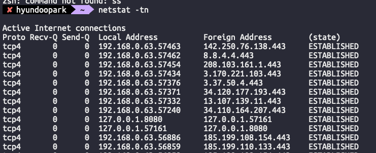

4장 커넥션 관리

HTTP는 TCP 커넥션을 어떻게 활용하는가

• HTTP 메시지는 이미 연결된 TCP 커넥션을 통해 순서대로 전송된다. TCP는 바이트 스트림을 세그먼트로 쪼개어 IP 패킷에 실어 보낸다.

• TCP 커넥션 식별자: <출발지 IP, 출발지 포트, 목적지 IP, 목적지 포트>

• 전이중 통신: 요청/응답은 양방향으로 동시에 흐를 수 있다. 다만 HTTP/1.1에서는 메시지 경계와 순서가 중요하다.

⸻

HTTP 트랜잭션의 단계
1. DNS 조회
2. TCP 연결(3-way handshake)
3. 요청 전송
4. 서버 처리
5. 응답 수신
6. 연결 종료(혹은 유지)
• 소규모 요청의 경우 연결 설정/종료 비용이 상대적으로 크게 느껴진다.

⸻

TCP 성능에 영향을 주는 요소
1. 연결 설정 지연(3-way handshake)
   • SYN → SYN/ACK → ACK 3단계를 거쳐야 한다.
   • 작은 요청에서는 연결 지연이 전체 지연의 대부분이 될 수 있다.
2. 확인 응답(ACK) 지연
   • 수신자는 ACK를 패킷에 실어 묶음 전송(피기백)하려고 잠시 지연한다.
   • 요청/응답이 단순하면 피기백 기회가 적어 지연이 체감될 수 있다.
3. 혼잡 제어와 느린 시작(Slow Start)
   • 새로운 연결은 작은 혼잡 윈도우에서 시작하며 점진적으로 늘린다.
   • 이미 예열된 연결을 재사용(지속 커넥션)하면 초기 전송량 제약을 완화할 수 있다.
4. Nagle 알고리즘
   • 작은 세그먼트를 모아 보낸다. 확인 응답 지연과 맞물리면 상호 지연을 키울 수 있다.
   • 지연 민감 트래픽에서는 TCP_NODELAY로 비활성화하기도 한다(신중히 사용).
5. TIME_WAIT과 포트 고갈
   • 연결 종료 후 클라이언트는 TIME_WAIT 상태를 유지하며 재전송/지연 패킷을 흡수한다.
   • 단시간에 많은 단대단 연결을 열고 닫으면 에페메럴 포트 고갈과 자원 압박이 생길 수 있다.

⸻

HTTP 커넥션 관리의 기본
- Connection 헤더는 홉-바이-홉(hop-by-hop) 헤더다. 중개자(프록시/게이트웨이)는 수신 시 제거하고, 다음 홉으로 보낼 값은 다시 구성한다.
- 전송 경로 상의 각 구간은 독립적인 TCP 연결이다. 하나의 경로에서 keep-alive를 사용해도 다른 구간에서는 새로 연결될 수 있다.

⸻

순차, 병렬, 지속, 파이프라인, 다중화
- 순차 연결: 리소스마다 새 연결을 열고 닫는다. 단순하지만 지연이 누적된다.
- 병렬 연결: 여러 연결을 동시에 연다. 체감 속도 개선 가능하나 대역폭/서버 부하/동시 연결 제한에 유의.
- 지속(persistent) 연결: 한 연결에서 여러 요청/응답을 순차로 재사용한다. 핸드셰이크·느린 시작 비용을 줄인다.
- 파이프라이닝(HTTP/1.1): 응답을 기다리지 않고 요청을 연달아 보낸다. 헤드-오브-라인(HOL) 블로킹과 중개자 호환성 문제로 브라우저에서는 사실상 비활성화.
- 다중화: HTTP/2는 하나의 TCP 연결에서 스트림 단위로 요청/응답을 다중화한다(HOL 완화, 우선순위, 헤더 압축). HTTP/1.1과 구분.

⸻

HTTP/1.0의 keep-alive 문제점
- 표준화 불균일: Connection: Keep-Alive와 Keep-Alive 헤더(파라미터)가 구현별로 달랐다.
- 중개자 호환성: 프록시가 헤더를 적절히 제거/설정하지 않으면 예기치 못한 연결 유지/종료가 발생했다.
- 결과: 동작이 예측 불가능했고, 서버/클라이언트 간 합의가 필요했다.

⸻

HTTP/1.1의 지속 커넥션
- 기본 동작: 별도 표시가 없으면 연결은 지속된다. 명시 종료는 Connection: close.
- 커넥션 재사용: 같은 호스트/포트/프로토콜에 대해 재사용하며, 서버는 유휴 시간 초과로 닫을 수 있다.
- 메시지 경계: Content-Length, 청크드 전송 인코딩으로 다음 메시지 경계를 식별한다.
- 서버 자원 보호: 최대 요청 수, 유휴 타임아웃 등을 설정해 폭주를 방지한다.

⸻

파이프라인 커넥션(HTTP/1.1)
- 요청은 순서대로 전송하고 응답도 같은 순서로 돌아온다(순서 불변).
- HOL 블로킹: 앞선 응답이 지연되면 뒤 응답도 지연된다.
⸻

우아한 커넥션 끊기
- 애플리케이션 드레인: 더 이상 새 요청을 받지 않고, 진행 중 요청을 마친 뒤 종료.
- 프로토콜 신호: Connection: close로 이번 응답 후 종료 의도를 알린다.
- TCP 레벨: FIN을 교환해 정리 종료. 필요 시 half-close(쓰기 종료)로 수신 버퍼를 비운다.
- 타임아웃: 유휴/읽기/쓰기 타임아웃을 합리적으로 설정해 좀비 연결을 정리한다.

⸻

추가 자료

현재 맺어진 TCP 커넥션 확인
- netstat -tn
  -t: TCP만 표시, -n: 주소/포트를 숫자로 표시(역조회 생략, 빠름)

현재 맺어진 TCP 커넥션 예시 출력

- netstat -tn

