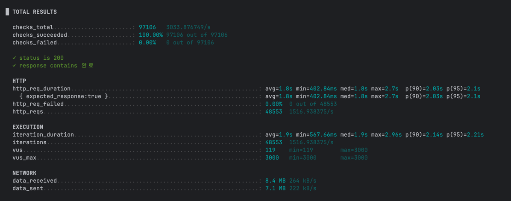
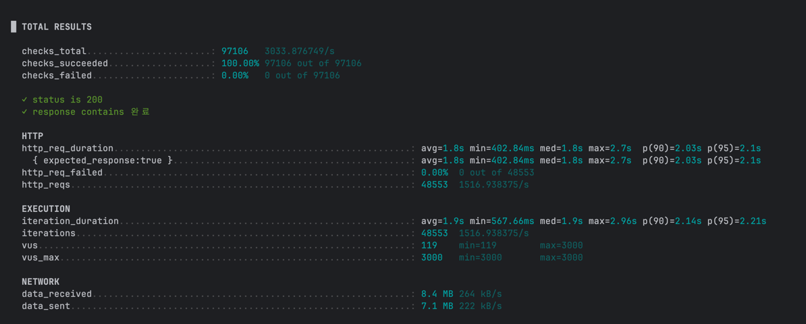

## 개요
 
Spring Framework의 `@Transactional` 어노테이션 유무에 따른 
MyBatis SqlSession의 동작과 성능 차이를 분석한 내용이다. 

## 데이터베이스
현재 회사는 MSSql 서버를 사용하고 있으며, 데이터베이스는 '단일 데이터베이스 구조'이다.
복원을 위한 Slave가 있으나, 복원용이고 Read 부하를 부담하지 않는 구조이다.

## 트랜잭션 유무의 차이점 

### @Transactional이 있는 경우
- Spring의 트랜잭션 관리자가 SqlSession 생명주기를 관리
- 하나의 트랜잭션 범위 내에서 동일한 SqlSession 인스턴스 재사용
- 트랜잭션 종료 시점에 자동 커밋/롤백
- 1차 캐시 활용 가능

### @Transactional이 없는 경우
- 각 데이터베이스 연산마다 새로운 SqlSession 생성
- 자동 커밋 모드로 동작
- 1차 캐시를 활용할 수 없음 (매번 새로운 SqlSession이므로)
- 개별 연산별 즉시 커밋

## 검증

아래의 코드를 수행해보고 1차캐시와 수행시간에 대해서 검증

```java
public void test() {
    User user1 = userMapper.selectUserById(1L);
    User user3 = userMapper.selectUserById(2L);
}
```

* 트랜잭션 어노테이션이 없는 경우 - 동일한 파라미터여도 매번 쿼리 수행
```
o.m.s.t.SpringManagedTransaction - JDBC Connection [HikariProxyConnection@1255319830 wrapping com.mysql.cj.jdbc.ConnectionImpl@20441386] will not be managed by Spring
p.s.mapper.UserMapper.selectUserById - ==>  Preparing: SELECT id, name, email, age FROM users WHERE id = ?
p.s.mapper.UserMapper.selectUserById - ==> Parameters: 1(Long)
p.s.mapper.UserMapper.selectUserById - <==      Total: 1
org.mybatis.spring.SqlSessionUtils - Closing non transactional SqlSession [org.apache.ibatis.session.defaults.DefaultSqlSession@44154fe4]
org.mybatis.spring.SqlSessionUtils - Creating a new SqlSession
org.mybatis.spring.SqlSessionUtils - SqlSession [org.apache.ibatis.session.defaults.DefaultSqlSession@befa32d] was not registered for synchronization because synchronization is not active
o.s.jdbc.datasource.DataSourceUtils - Fetching JDBC Connection from DataSource
o.m.s.t.SpringManagedTransaction - JDBC Connection [HikariProxyConnection@984492137 wrapping com.mysql.cj.jdbc.ConnectionImpl@20441386] will not be managed by Spring
p.s.mapper.UserMapper.selectUserById - ==>  Preparing: SELECT id, name, email, age FROM users WHERE id = ?
p.s.mapper.UserMapper.selectUserById - ==> Parameters: 1(Long)
p.s.mapper.UserMapper.selectUserById - <==      Total: 1
```

* 트랜잭션 어노테이션이 있는 경우 - 각 파라미터에 대해 한번만 쿼리 수행
```
org.mybatis.spring.SqlSessionUtils - Creating a new SqlSession
org.mybatis.spring.SqlSessionUtils - Registering transaction synchronization for SqlSession [org.apache.ibatis.session.defaults.DefaultSqlSession@6b43d462]
o.m.s.t.SpringManagedTransaction - JDBC Connection [HikariProxyConnection@1639694098 wrapping com.mysql.cj.jdbc.ConnectionImpl@20441386] will be managed by Spring
p.s.mapper.UserMapper.selectUserById - ==>  Preparing: SELECT id, name, email, age FROM users WHERE id = ?
p.s.mapper.UserMapper.selectUserById - ==> Parameters: 1(Long)
p.s.mapper.UserMapper.selectUserById - <==      Total: 1
org.mybatis.spring.SqlSessionUtils - Releasing transactional SqlSession [org.apache.ibatis.session.defaults.DefaultSqlSession@6b43d462]
org.mybatis.spring.SqlSessionUtils - Fetched SqlSession [org.apache.ibatis.session.defaults.DefaultSqlSession@6b43d462] from current transaction
org.mybatis.spring.SqlSessionUtils - Releasing transactional SqlSession [org.apache.ibatis.session.defaults.DefaultSqlSession@6b43d462]
org.mybatis.spring.SqlSessionUtils - Fetched SqlSession [org.apache.ibatis.session.defaults.DefaultSqlSession@6b43d462] from current transaction
p.s.mapper.UserMapper.selectUserById - ==>  Preparing: SELECT id, name, email, age FROM users WHERE id = ?
p.s.mapper.UserMapper.selectUserById - ==> Parameters: 2(Long)
p.s.mapper.UserMapper.selectUserById - <==      Total: 1
```
### 트랜잭션 유무에 따른 성능 비교

#### 단일 메서드 수행시간 
* 트랜잭션 어노테이션이 없는 경우
```
 p.s.service.TransactionTestService - 복합 작업 (트랜잭션 없음) 소요시간: 31ms
```
* 트랜잭션 어노테이션이 있는 경우
```
p.s.service.TransactionTestService - 복합 작업 (트랜잭션 있음) 소요시간: 4ms
```

### 검증 결과
매번 새로은 세션을 사용하여 쿼리를 수행하기 때문에 오버헤드가 발생하고  단순 조회쿼리로만 성능을 비교했음에도 불구하고 7-8배의 차이가 난다.

### 부하테스트 결과

* 3000 VUS + 30초로 수행했을 때 결과

* 트랜잭션 없을 경우



* 트랜잭션 있는 경우 



### 결론 

트래픽이 일정 이상을 초과하는 경우, 세션과 커넥션을 새로 맺는 비용보다 데이터베이스에서 트랜잭션을 관리하는 비용이 더 크다.